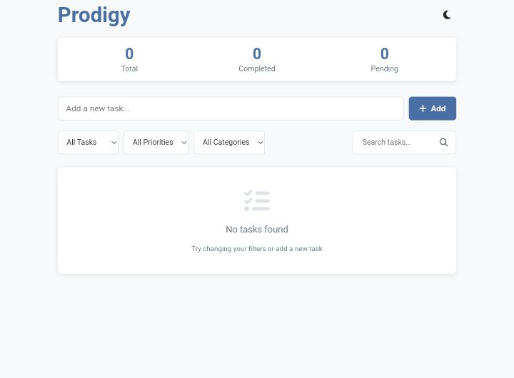
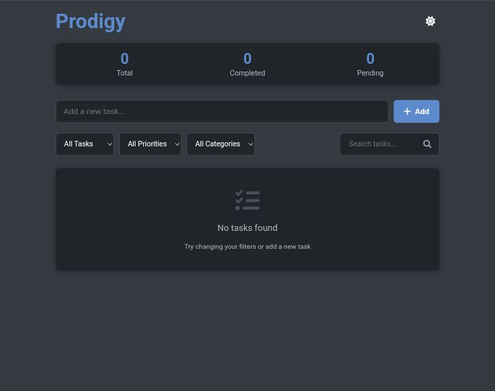
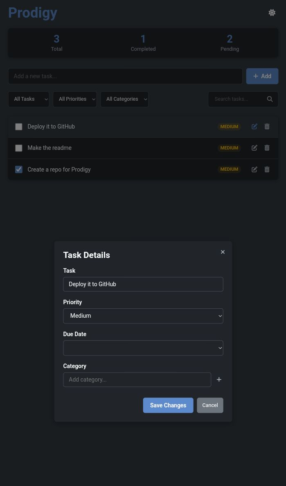
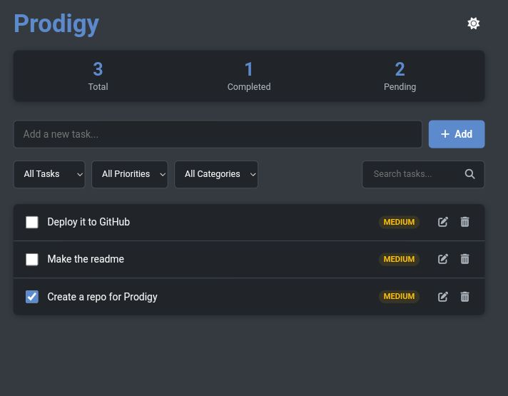

# Prodigy – Your Ultimate Productivity Companion 🧠✅

**Prodigy** is a sleek and modern task management tool that goes beyond basic checklists. Built with **HTML**, **CSS**, and **JavaScript**, it delivers an intuitive and responsive experience with rich features like smart filtering, priority levels, drag-and-drop reordering, dark/light themes, and persistent local storage.

Stay focused, stay organized — whether you're managing work, chores, or personal goals, Prodigy has you covered.

---

## ✨ Features

### ✅ Task Management
- Add, edit, and delete tasks
- Mark tasks as complete with a checkbox
- Set priority levels: High / Medium / Low
- Add due dates with visual overdue indicators
- Assign categories/tags for better organization

### 🔍 Smart Filtering & Search
- Filter tasks by:
  - Status (All, Completed, Pending)
  - Priority (High, Medium, Low)
  - Category
- Quick search to instantly locate tasks

### 📦 Drag & Drop Reordering
- Easily rearrange tasks via intuitive drag-and-drop

### 🌗 Dark/Light Mode
- Toggle themes for better visual comfort

### 📊 Task Statistics
- View total, completed, and pending tasks in real time

### 💾 Local Storage Support
- All tasks and user settings persist in your browser

---

## 🖼 Screenshots

| Light Mode | Dark Mode |
|------------|-----------|
|  |  |

| Task Detail View | Sample Task List |
|------------------|------------------|
|  |  |

> 📁 Make sure to place your screenshots in a `screenshots/` folder at the root of your repo and name them:
> - `light-mode.png`
> - `dark-mode.png`
> - `task-detail.png`
> - `sample-list.png`

---

## 🛠 Technologies Used

- **HTML5** – Semantic structure
- **CSS3** – Responsive design, styling & animations
- **JavaScript (ES6)** – Interactivity & functionality
- **Local Storage** – Client-side data persistence
- **Font Awesome** – Icons and visual enhancements

---

## 🚀 How to Use

### 1. Add a Task
- Type into the input field and click **"Add"** or press **Enter**

### 2. Edit a Task
- Click the **edit (pencil)** icon
- Modify the task's text, priority, due date, or category
- Save your changes

### 3. Delete a Task
- Click the **trash** icon
- Confirm deletion

### 4. Complete a Task
- Check the **checkbox** to mark it complete

### 5. Filter & Search
- Use dropdowns to filter tasks by status, priority, or category
- Use the **search bar** to quickly find tasks

### 6. Reorder Tasks
- Drag and drop tasks to update their order

### 7. Toggle Theme
- Click the **moon/sun** icon to switch between dark and light modes

---

## 📱 Responsive Design

Prodigy works seamlessly across all screen sizes — from desktops to mobile devices.

---

## 📌 License

This project is open-source and available under the [MIT License](LICENSE).
